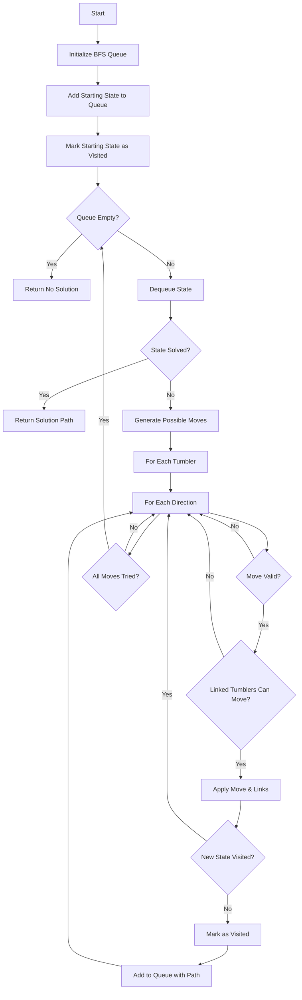

# Lockpick Solver Component

A Svelte 5 component for solving Gothic 1 Remake lockpicking puzzles using a BFS-based algorithm.

## Overview

The lockpick solver helps users solve the lockpicking minigame from Gothic 1 Remake by calculating the optimal sequence of tumbler movements to align all tumblers to the center position.

## Game Mechanics

### Tumblers
- Each lock has multiple horizontal tumblers (typically 5-7)
- Each tumbler has holes (typically 7 holes, numbered 1-7)
- Tumblers can move left or right one position at a time
- Position 4 (for 7-hole tumblers) is the center/solved position

### Links
- Links connect tumblers together
- When a tumbler moves, all linked tumblers also move
- Links can be normal (same direction) or reversed (opposite direction)
- **Constraint**: Linked tumblers must be able to move together. If moving a tumbler would cause a linked tumbler to go out of bounds (position < 1 or > numHoles), the move is invalid.

### Win Condition
- All tumblers must be aligned to the center position
- For 7-hole tumblers, the center is position 4 (calculated as `Math.ceil(7/2)`)
- The center dot fills when all tumblers are correctly aligned

## Usage

### Basic Usage

```svelte
<script>
  import { LockpickSolver } from '$lib/components/lockpick';
</script>

<LockpickSolver />
```

### Lock Data Structure

Locks are stored in `src/lib/data/locks.json` with the following structure:

```typescript
interface GothicLock {
    id: string;
    name: string;
    description: string;
    location: string;
    numTumblers: number;
    numHoles: number;
    startingPositions: number[]; // 1-based positions
    links: Array<{
        from: number;      // Source tumbler index (0-based)
        to: number;        // Target tumbler index (0-based)
        reversed: boolean;  // If true, moves in opposite direction
    }>;
}
```

### Example Lock Configuration

```json
{
  "id": "new-mine-chest",
  "name": "New Mine Chest",
  "description": "Chest on the way to the top tunnel outlet",
  "location": "New Mine",
  "numTumblers": 5,
  "numHoles": 7,
  "startingPositions": [1, 5, 1, 7, 3],
  "links": [
    { "from": 0, "to": 3, "reversed": true },
    { "from": 1, "to": 0, "reversed": false },
    { "from": 1, "to": 2, "reversed": true },
    { "from": 1, "to": 4, "reversed": true },
    { "from": 2, "to": 0, "reversed": true },
    { "from": 3, "to": 2, "reversed": true },
    { "from": 3, "to": 4, "reversed": true },
    { "from": 4, "to": 0, "reversed": false },
    { "from": 4, "to": 1, "reversed": true }
  ]
}
```

## UI Features

### Manual Mode
- Click left/right arrows on each tumbler to move them
- Links are automatically applied when tumblers move
- Reset tumblers to starting positions
- Save current positions for later reference

### Auto Solve Mode
- Click "Auto Solve" to calculate the optimal solution
- View step-by-step instructions
- Apply each step individually with "Apply Next Step"
- Reset to start over

### Link Configuration
- Add new links between tumblers
- Specify normal or reversed direction
- Remove existing links
- Links are saved with the lock configuration

## Solver Algorithm

The solver uses a Breadth-First Search (BFS) algorithm to find the shortest sequence of moves to solve the lock.

### Algorithm Flow



### Solver Implementation

```typescript
export function solveLock(
    startingPositions: number[],
    links: Array<{ from: number; to: number; reversed: boolean }>,
    numHoles: number
): SolverResult {
    const centerPos = Math.ceil(numHoles / 2);
    const numTumblers = startingPositions.length;

    // Check if already solved
    if (startingPositions.every((pos) => pos === centerPos)) {
        return { solvable: true, moves: [] };
    }

    // BFS to find shortest path
    const queue: { positions: number[]; path: SolverMove[] }[] = [
        { positions: [...startingPositions], path: [] },
    ];

    const visited = new Set<string>();
    visited.add(startingPositions.join(","));

    let iterations = 0;
    const maxIterations = 100000;

    while (queue.length > 0 && iterations < maxIterations) {
        iterations++;
        const { positions, path } = queue.shift()!;

        // Try all possible moves
        for (let i = 0; i < numTumblers; i++) {
            for (const direction of ["left", "right"] as const) {
                const newPos = direction === "left"
                    ? positions[i] - 1
                    : positions[i] + 1;

                // Check if move is valid (within bounds)
                if (newPos < 1 || newPos > numHoles) continue;

                // Check if all linked tumblers can move
                const newPositions = [...positions];
                newPositions[i] = newPos;
                let allLinksCanMove = true;

                for (const link of links) {
                    if (link.from === i) {
                        const linkedNewPos = link.reversed
                            ? newPositions[link.to] - 1
                            : newPositions[link.to] + 1;
                        if (linkedNewPos < 1 || linkedNewPos > numHoles) {
                            allLinksCanMove = false;
                            break;
                        }
                        newPositions[link.to] = linkedNewPos;
                    }
                }

                if (!allLinksCanMove) continue;

                // Check if solved
                if (newPositions.every((pos) => pos === centerPos)) {
                    return {
                        solvable: true,
                        moves: [
                            ...path,
                            {
                                tumblerIndex: i,
                                direction,
                                positionsAfter: newPositions,
                            },
                        ],
                    };
                }

                // Add to queue if not visited
                const stateKey = newPositions.join(",");
                if (!visited.has(stateKey)) {
                    visited.add(stateKey);
                    queue.push({
                        positions: newPositions,
                        path: [
                            ...path,
                            {
                                tumblerIndex: i,
                                direction,
                                positionsAfter: newPositions,
                            },
                        ],
                    });
                }
            }
        }
    }

    return {
        solvable: false,
        moves: [],
        message: "Could not find a solution within iteration limit",
    };
}
```

### Key Features

1. **BFS Guarantees Shortest Path**: Since BFS explores states level by level, the first solution found is guaranteed to be the shortest.

2. **Visited Set Prevents Loops**: The visited set ensures we don't revisit the same state, preventing infinite loops and improving performance.

3. **Iteration Limit**: A safety limit (500,000 iterations) prevents the solver from running indefinitely on unsolvable or very complex locks. The 7-tumbler Test Lock requires ~155,000 BFS iterations to solve, so 500,000 provides a reasonable safety margin for most configurations.

4. **Link Constraints**: The solver respects the constraint that linked tumblers must move together and cannot go out of bounds.

## Component API

### Props

The `LockpickSolver` component accepts no props. It manages its own state and loads lock data from the local storage adapter.

### State Management

The component uses Svelte 5 runes for reactive state:
- `$state` for tumbler positions, current lock, solver results
- `$props` for component configuration
- `$effect` for side effects

## Files

- `LockpickSolver.svelte` - Main component with UI and solver integration
- `index.ts` - Solver algorithm and lock data management
- `README.md` - This file

## Performance Considerations

- The solver uses BFS which has O(b^d) complexity where b is branching factor and d is solution depth
- For locks with many tumblers and complex links, the state space can be very large
- The iteration limit prevents excessive computation time
- Consider using A* or other heuristic algorithms for very complex locks if needed

## Future Improvements

- [x] Fix link constraint logic based on actual game mechanics
- [ ] Add A* algorithm with heuristic for better performance on complex locks
- [ ] Implement undo/redo functionality
- [ ] Add visual indicators for locked tumblers (cannot move due to link constraints)
- [ ] Support for different hole counts (not just 7)
- [ ] Export/import lock configurations
- [ ] Hint system for manual solving
